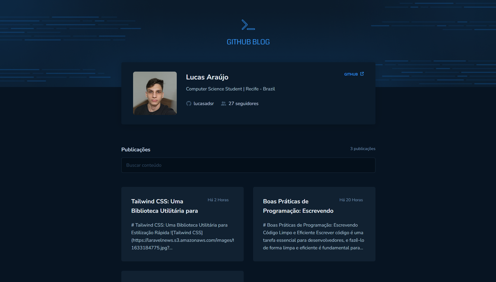

# Github Blog
<div align="center">
   
</div>

## Descrição do Projeto

Este projeto é um blog que utiliza a API do Github para exibir postagens criadas a partir das *issues* do repositório do projeto.

O projeto foi desenvolvido utilizando diversas tecnologias modernas, proporcionando uma experiência de desenvolvimento ágil e um desempenho eficiente. As principais tecnologias utilizadas neste projeto são:

- [Vite](https://vitejs.dev/): Um ecossistema de desenvolvimento web rápido e moderno que permite construir aplicações front-end com alta performance.
- [React Router DOM](https://reactrouter.com/): Uma biblioteca de roteamento para React que permite a criação de rotas e navegação de forma simples e declarativa.
- [Context API](https://reactjs.org/docs/context.html): Uma API do React que permite o compartilhamento de estados entre componentes sem a necessidade de *props* intermediárias.
- [Axios](https://axios-http.com/): Uma biblioteca JavaScript para fazer requisições HTTP baseadas em Promises, utilizada aqui para interagir com a API do Github.
- [date-fns](https://date-fns.org/): Uma biblioteca JavaScript para manipulação e formatação de datas.
- [React Markdown](https://github.com/remarkjs/react-markdown): Uma biblioteca que transforma texto em Markdown em componentes React, permitindo a exibição de conteúdo formatado a partir do texto das *issues*.
- [Styled Components](https://styled-components.com/): Uma biblioteca para estilização de componentes React através de *templates* literais de JavaScript.
- [Zod](https://github.com/colinhacks/zod): Uma biblioteca para validação de esquemas de dados em JavaScript/TypeScript.

## Funcionalidades Principais

- Exibição das postagens através da integração com as *issues* do repositório do projeto no Github.
- Página individual para cada postagem, mostrando o conteúdo formatado em Markdown e informações adicionais, como data de criação e autor.
- Pesquisa das postagens de acordo com o conteúdo
- Layout responsivo.

## Como rodar o projeto

1. Clone este repositório para o seu computador:
```bash
git clone https://github.com/lucasadsr/github-blog.git
```

2. Acesse a pasta do projeto:
```bash
cd github-blog
```

3. Instale as dependências do projeto:
```bash
npm install
```

4. Inicie o servidor de desenvolvimento:
```bash
npm run dev
```

6. O projeto estará disponível localmente em `http://localhost:5173/`.